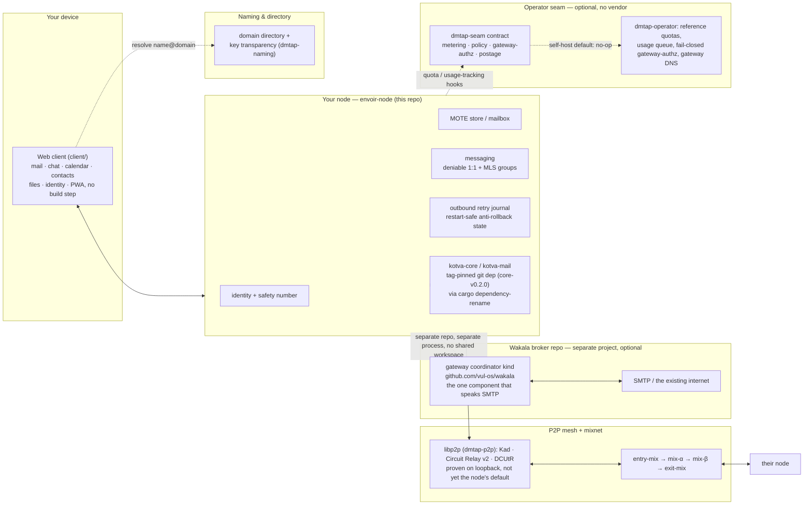

<p align="center">
  
</p>

<h1 align="center">Envoir</h1>

<p align="center">
  <b>Sovereign mail, chat, files &amp; identity — your key is your identity, not an account.</b>
</p>

<p align="center">
  <a href="LICENSE-MIT"></a>
  <a href="node/Cargo.toml"></a>
  
  <a href="https://github.com/vul-os/kotva"></a>
</p>

<p align="center">
  
  
</p>

## What is Envoir

Envoir is the open-source **node reference implementation of DMTAP** (the Decentralized Message
Transfer & Access Protocol, KOTVA's mail profile): one sovereign **keypair identity** for mail,
chat, calendar, contacts, files, and groups, delivered over a peer-to-peer mesh and mixnet so that
not even a global observer sees who talks to whom. A human address like `you@envoir.org` is only a
*pointer* to your key — lose the provider, keep the identity. Naming itself is **pluggable**: a
zero-authority key-name and a local petname need no DNS at all, `name@domain` (DNS + key
transparency) is the default, and an OPTIONAL crypto name-chain resolver (ENS `.eth` / SNS `.sol`,
off by default, bound by four guardrails) is a third alternative — every rung still resolves to,
and pins, the same key. See [docs/naming.md](docs/naming.md). Envoir is to DMTAP what Element is to
Matrix: the branded, MIT-licensed node + client for one open protocol. There is **no
cryptocurrency and no blockchain** anywhere in this project — anti-abuse for cold contact uses
anonymous Privacy-Pass-style rate-limit tokens, proof-of-work, and optional real-money postage,
never a coin.

**This repository is node-only.** Two pieces that used to live here moved out, each for the same
reason — a shared, single-owner implementation beats a copy forked into every consumer:

- **The legacy-mail gateway** — the optional SMTP/IMAP/POP3 bridge — folded into the **[Wakala
  broker repo](https://github.com/vul-os/wakala)** as its `gateway` coordinator kind: one
  accountable, swappable, self-hostable bridge shared by every project built on the same substrate,
  rather than a copy of gateway code duplicated per client. A node with no legacy correspondents
  never needs it at all; one with legacy correspondents points at a Wakala-run gateway, or runs its
  own from that repo. See [Node binary, and the gateway](#node-binary-and-the-gateway-optional-external)
  below.
- **The substrate** — identity, the MOTE object, content addressing, canonical CBOR, delegated
  capability tokens, and the client mail-protocol servers (IMAP/POP3/SMTP-submission, JMAP) —
  formerly the in-tree `dmtap-core`/`dmtap-mail` crates, carved out into the **[KOTVA
  repo](https://github.com/vul-os/kotva)** as `kotva-core`/`kotva-mail`. Envoir now consumes them as
  a **tag-pinned git dependency** (`core-v0.2.0`, never a moving branch or path) via Cargo's
  dependency-rename, so every existing `use dmtap_core::…` / `use dmtap_mail::…` line in this
  codebase is unchanged:
  ```toml
  dmtap-core = { package = "kotva-core", git = "https://github.com/vul-os/kotva", tag = "core-v0.2.0" }
  ```
  The tag pin is the whole point: a shared core that downstream consumers track at a moving HEAD
  churns out from under them the moment it changes — pinning a tag is what keeps a breaking change
  on the substrate side from silently breaking envoir's build.

This repository is a **reference implementation / preview** — a real client compiles the Rust core
to WASM and speaks to a real mesh; today's web client simulates the network (clearly labeled) so the
whole protocol is demonstrable end to end in a browser, installable and fully responsive down to
phone width. See [Security & honesty](#security--honesty) for exactly what's real.

| Surface | What it gives you |
|---|---|
| **Mail** | Three-pane inbox, threading, labels, snooze, scheduled/undo send, per-message **transport-path provenance** |
| **Chat** | DMs (deniable X3DH + Double Ratchet) and channels (signed MLS groups) on the same MOTE substrate |
| **Calendar** | Month/week/day views + agenda, recurring events, meetings with invitees, peer-to-peer invitations + RSVP |
| **Contacts** | Per-contact key verification — TOFU-pinned vs. verified via safety number — not just a name and photo |
| **Files** | Content-addressed, end-to-end encrypted, any size; a shared folder *is* a group |
| **Groups** | A group has an address (`team@envoir.org`); broadcast vs. channel, members + roles |
| **Identity** | Safety number (words/digits/QR-grid), avatars/profile, linked devices, signed-in apps, recovery phrase |
| **Installable & offline** | A PWA: home-screen install, offline app-shell load, content-free Web Push wake-pings |

## Mail

Three-pane conversation view with folders, color labels, star/archive/snooze, scheduled send, undo
send, and rich compose with signatures. Every message carries a **verified ✓** badge once you've
checked its sender's safety number, and a clear **legacy-origin** marker when it arrived through a
gateway (an optional Wakala-hosted bridge, not part of this repo — see below) rather than pure-mesh.

<p align="center">
  
  
</p>

## Chat

DMs and channels (channels are **groups with addresses**) over the same MOTE substrate as mail, just
`kind=chat` on the fast tier. Every conversation header carries an honest protocol badge: a DM is
**Deniable 1:1** (pairwise X3DH + Double Ratchet, MAC-authenticated — no signature ties a message to
you), a channel is **MLS group · signed** (scales to any group size, but each message's signature is
non-repudiable). Click the badge for the tradeoff, spelled out in full.

<p align="center">
  
  
</p>

## Calendar

Month, week, and day views with an always-visible agenda rail, recurring events, and per-event
reminders. Adding invitees turns an event into a **meeting**; invitations and RSVPs travel as
peer-to-peer MOTEs — free/busy is a message, not a query against a central calendar server. See
[docs/features/calendar.md](docs/features/calendar.md).

<p align="center">
  
  
</p>

## Contacts

An address book where the **key**, not the name or photo, is what's being verified: every card
shows **verified** (safety-number checked), **TOFU-pinned**, or **legacy**, plus a gradient
avatar, opt-in Gravatar-style picture, or key-derived identicon. See
[docs/features/contacts.md](docs/features/contacts.md).

<p align="center">
  
</p>

## Transport-path provenance

Every received message carries a recipient-only provenance record: which transport **tier** it
arrived on, whether it is **pure-mesh** (never plaintext at any gateway) or **gateway-touched**
(legacy-origin, with a verified domain-anchored attestation), and — for the private tier — a
guaranteed **hop-count floor**, never a measured route. The UI is careful never to invent a mix-node
identity or claim more anonymity than the tier actually provides.

<p align="center">
  
</p>

## Files

Content-addressed, end-to-end encrypted, chunked and hashed client-side — any file size, no protocol
cap. A shared folder is simply a **group**: drop a file, and everyone with membership can read it.

<p align="center">
  
</p>

## Identity

Your key is the security boundary; the address is just a pointer to it. The Identity view surfaces
the **safety number** (words, digits, and a scannable grid, derived deterministically from your
public key alone), your **avatar and profile** (a public URL, an opt-in Gravatar-style picture, or
a deterministic key-identicon as the fallback — never something that changes your safety number),
your linked devices, your signed-in apps, and recovery. See
[docs/features/identity.md](docs/features/identity.md#avatars-and-profile).

<p align="center">
  
</p>

## Capabilities, and Envoir Send

Every fine-grained permission in DMTAP — reading one mailbox folder, posting to one channel,
sending mail programmatically — is a signed, offline-verifiable **delegated capability token**
(a UCAN profile, now defined in `kotva-core`:
[`capability.rs`](https://github.com/vul-os/kotva/blob/core-v0.2.0/crates/kotva-core/src/capability.rs)):
attenuable (a child grant can only narrow its parent, never widen it) and independently
**revocable**, so rotating one scoped credential never touches the root identity key. The natural
application built on that primitive is **[Envoir Send](crates/dmtap-send)** — a Resend-style
programmatic mail-sending API where every API key is a narrowly-scoped, rotatable send-only
capability: a sovereign, self-hostable alternative to a hosted transactional-email service. The
capability primitive itself is real and tested today; the dedicated send-service surface is a
roadmap item, not yet part of this workspace. See
[docs/protocol.md](docs/protocol.md#delegated-capabilities-and-envoir-send).

## Installable, offline, and mobile

The client is a real **Progressive Web App**: `manifest.webmanifest` + a service worker that
precaches the app shell so it opens even offline, an install affordance wired to the browser's own
install prompt, and **content-free Web Push** — a wake-up ping whose payload is deliberately never
read, so it can only ever mean "your node has something new, go sync," never who or what. The
whole UI is responsive down to ~360px phones, with a bottom tab bar below 680px. See
[docs/pwa-and-push.md](docs/pwa-and-push.md) for the full model, including its one disclosed
residual: on iOS, Apple's own **APNs** unavoidably sits in the delivery path for *any* web app's
push, Envoir included — the ping stays content-free through it, but its existence and timing are
visible to Apple as the platform operator, exactly as for any other web app.

<p align="center">
  
  
  
  
  
</p>
<p align="center"><sub>The same app, responsive down to ~360px — Mail · Chat · Identity · Calendar · Contacts</sub></p>

## Architecture



Nobody runs Envoir as a business, and there is no control plane. In **self-host** mode every
`dmtap-seam` hook is unlimited/no-op, so the OSS stack is fully functional standalone. If a
third-party **operator** runs a node (or a Wakala gateway) for other people, they can add quotas,
usage accounting, and legacy-egress authorization at the `dmtap-seam` boundary — `dmtap-operator` is
a working, non-commercial reference implementation of exactly that (see its crate docs) — without
forking the protocol. Nothing behind that seam can ever gate privacy, cryptography, or recovery.

| Path | What it is |
|---|---|
| [`node/`](node) | **envoir-node** — the whole client side: identity, mailbox, mesh, messaging, files, JMAP, the Send API, and the substrate crates (`kotva-core`/`kotva-mail`) as a pinned git dependency |
| [`crates/dmtap-auth`](crates/dmtap-auth) | DMTAP-Auth — decentralized, key-based sign-in |
| [`crates/dmtap-deniable`](crates/dmtap-deniable) | Deniable 1:1 messaging (X3DH + Double Ratchet) |
| [`crates/dmtap-mls`](crates/dmtap-mls) | MLS group messaging |
| [`crates/dmtap-naming`](crates/dmtap-naming) | The pluggable naming/addressing resolver framework (key-name, petname, DNS + key-transparency, optional name-chains) — see [docs/naming.md](docs/naming.md) |
| [`crates/dmtap-namechain-rpc`](crates/dmtap-namechain-rpc) | Real, network-backed name-chain resolvers (ENS/SNS) behind `dmtap-naming`'s client seam |
| [`crates/dmtap-p2p`](crates/dmtap-p2p) | The real libp2p mesh transport (TCP/QUIC+Noise+Yamux, Kademlia, Circuit Relay v2 + DCUtR), proven on loopback — not yet the node binary's default |
| [`crates/dmtap-clustersync`](crates/dmtap-clustersync) | Device-cluster sync (spec §5.6): an owner's own devices converge on one mailbox/history with no primary and no central server |
| [`crates/dmtap-sync`](crates/dmtap-sync) | The shared substrate Sync engine — signed, deterministic, multi-author CRDT operation algebra with range-Merkle reconciliation |
| [`crates/dmtap-sync-wasm`](crates/dmtap-sync-wasm) | `wasm-bindgen` binding so a JS product can run the same compiled sync engine instead of a hand-rolled CRDT |
| [`crates/dmtap-send`](crates/dmtap-send) | **Envoir Send** — the reusable library core of a Resend-style, capability-scoped programmatic mail API |
| [`crates/dmtap-seam`](crates/dmtap-seam) | The **operator seam**: metering, provisioning, policy, gateway-authz, and an optional provider-agnostic prepaid-postage hook (`postage`) — no billing logic, no payment provider, no control plane, anywhere in this crate |
| [`crates/dmtap-operator`](crates/dmtap-operator) | Reference operator machinery implementing `dmtap-seam`: a bounded/idempotent usage queue, flat quotas, the fail-closed gateway-authorization logic (spec §12.2), and gateway-domain DNS record automation — no commercial code |
| [`crates/dmtap-postage-patala`](crates/dmtap-postage-patala) | **Optional, isolated** reference postage payment-provider adapter backed by [`patala`](https://github.com/vul-os/patala) (Stellar micropayment rail) — one of many possible `postage::PostageProvider` implementations; never a dependency of `dmtap-seam` or the default build |
| [`crates/conformance-runner`](crates/conformance-runner) | Runs this reference against the spec's conformance catalog (drawn from the sibling KOTVA repo) plus its own committed wire-vector corpus |
| [`crates/netsim`](crates/netsim), [`crates/downgrade-tests`](crates/downgrade-tests) | Network simulation + downgrade-attack regressions |
| [`client/`](client) | Web client — mail, chat, calendar, contacts, files, groups, identity; installable PWA with offline shell + push |
| [`console/`](console) | Open-source **domain admin** console (org-level, never sees member keys) |
| [`status/`](status) | Public + personal status page |
| [`superadmin/`](superadmin) | Fleet operator console — content-blind by construction |
| [`site/`](site) | Marketing/landing page |
| [`integration/`](integration), [`fuzz/`](fuzz), [`formal/`](formal) | Cross-component + adversarial tests, wire-decoder fuzzing, ProVerif symbolic models |
| [`brand/`](brand) | Logo marks, wordmark, and the Aurora Indigo design tokens |

**No longer in this repository:** `gateway/` (now `github.com/vul-os/wakala`'s `gateway` coordinator
kind) and `crates/dmtap-core` / `crates/dmtap-mail` (now `kotva-core` / `kotva-mail` in
`github.com/vul-os/kotva`, consumed here as a tag-pinned git dependency — see
[What is Envoir](#what-is-envoir) above).

## Node binary, and the gateway (optional, external)

Envoir ships one program, `envoir-node`. `envoir-node run` is a plain mesh participant: identity,
mailbox, mesh, messaging, files, JMAP, and the Send API — nothing that speaks legacy SMTP/IMAP/POP3
runs inside it (spec §8.5, native-only).

For backward compatibility, `envoir-node` still accepts a `gateway <args>` / `--gateway <args>`
subcommand that hands off to a **separate, externally built gateway binary** as a genuinely separate
OS process (`exec` on Unix), never linking gateway code into the node's own address space. That
gateway binary is no longer built from this workspace — it now ships from the **[Wakala broker
repo](https://github.com/vul-os/wakala)** (`cargo build -p gateway` there, binary name
`wakala-gateway`). Point the node at it with `ENVOIR_GATEWAY_BIN=/path/to/wakala-gateway`; a node
with no legacy correspondents never needs to set this at all. See
[`node/tests/gateway_dispatch.rs`](node/tests/gateway_dispatch.rs) for exactly what this dispatch
shim does and does not guarantee today, and the Wakala repo's own README for running a gateway.

A gateway is not a privileged tier of node, and running one costs nothing to Envoir and requires no
payment method anywhere. To run one, an operator needs a public, static IP with correct **reverse
DNS (PTR)**, outbound **port 25** unblocked, and at least one **domain** they control so
`_dmtap`/MX/SPF/DKIM/DMARC records can be published (see
[`crates/dmtap-operator/src/dns.rs`](crates/dmtap-operator/src/dns.rs) for the automatable record
set) — nothing else. No billing account, no control plane, no vendor.

## Quickstart

```sh
# Build the whole envoir workspace (node + every crate above — dmtap-postage-patala is a
# separate, non-default member; see crates/dmtap-postage-patala/Cargo.toml). The substrate
# (kotva-core/kotva-mail) is fetched as a tag-pinned git dependency, not built from a sibling path.
cargo build --workspace

# Two in-process nodes exchange a real, end-to-end-encrypted MOTE
cargo run -p envoir-node -- demo

# The real node daemon (persists identity + outbound queue, serves until stopped)
cargo run -p envoir-node -- init   # once, to create a keystore
cargo run -p envoir-node -- run

# Optional: bridge to legacy SMTP by pointing the node's dispatch shim at a gateway binary built
# from the separate Wakala repo (see "Node binary, and the gateway" above) — nothing to build here
ENVOIR_GATEWAY_BIN=/path/to/wakala-gateway cargo run -p envoir-node -- gateway run
```

The web client needs no build step — no framework, no npm, no CDNs:

```sh
cd client
python3 -m http.server 8095
# open http://localhost:8095
```

`console/`, `status/`, `superadmin/`, and `site/` each run the same way — see their own `README.md`.

## Self-hosting

Self-hosting is not a crippled tier — every protocol feature, client, and privacy guarantee is
available with no operator at all; a hosted operator only ever sells convenience (see
[docs/features/self-hosting.md](docs/features/self-hosting.md)). Beyond the `cargo run` commands
above, a [`deploy/`](deploy) directory (reference Docker/compose and process-supervision examples
for `envoir-node`) is available — see its own [`README.md`](deploy/README.md) for the exact steps.

## Spec

The normative specification is **not** in this repository — it lives in the sibling
**[vul-os/kotva](https://github.com/vul-os/kotva)** repo (the KOTVA substrate; DMTAP is its **mail
profile**, which envoir implements): markdown sections spanning identity, MOTE, naming, transport,
messaging, privacy, the legacy gateway, clients, anti-abuse, conformance and more, a registry of
error codes (§21 plus the extension profiles that register their own), grounded against current
standards, plus a compiled spec PDF. This repo is one
implementation of that spec — the node — and no longer carries the gateway's own share of the
catalog (the gateway, and its conformance coverage, moved to Wakala). Conformance is checked
mechanically by [`crates/conformance-runner`](crates/conformance-runner) — see
[Security & honesty](#security--honesty).

## Security & honesty

Envoir's privacy model is **honest, not absolute**: recovery is a first-class, versioned, signed
policy (spec §1.4) built from phrase, linked-device, and Shamir'd social-guardian factors that the
owner composes and rotates — never a silent key-escrow backdoor. (The web client's onboarding shows
a 12-word demo phrase; a real client uses the full SLIP-0039 word list.) Nine ceremonies and
composed primitives — the deniable 1:1 handshake and its offline deniability, DMTAP-Auth sign-in,
the MLS group key schedule, key-transparency append-only logs, mixnet unlinkability, the §1.3
suite-downgrade ratchet, §5.1 group-committer fork evidence, and the §2.7/§9.2a cold-sender gate
binding — have machine-checked **ProVerif symbolic models** in [`formal/`](formal) (secrecy, mutual
authentication, forward secrecy, deniability, replay/origin-binding, post-compromise security,
inclusion/no-rollback/split-view soundness, fork-evidence soundness — see its README for exact
property statements and honest limitations, including the stateful invariants ProVerif
structurally cannot express and which are therefore *not* claimed), gated in CI by
[`formal/check.sh`](formal/check.sh) against recorded verdicts so a proof that silently breaks
fails the build instead of printing; the wire-format decoders are exercised by **`cargo-fuzz`**
targets in [`fuzz/`](fuzz).

`crates/conformance-runner` runs against the spec's own conformance catalog (358 cases as of this
writing) plus its own committed wire-vector corpus: **177 of 358** catalog cases execute and pass
today (0 failures) — of the 181 that don't execute, 19 are settled by implementer attestation (a
process/UX MUST with no bytes to recompute) and 162 are construction recipes this reference doesn't
build yet, most still awaiting triage. That remainder is a real gap, stated as one, not a rounding
of "passing" upward. One category, **Legacy** (44 cases, the gateway's own share of the catalog),
now executes **zero** cases from this repo *by design*: gateway logic — and the harness that proves
it — moved to the Wakala repo along with the gateway itself, so this repo's honest number for that
category is genuinely zero, not a skip waiting to be filled in here. Alongside the catalog run,
`conformance-runner`'s own `vectors.json` passes all 87 of its generated wire/pub/pubsub vectors,
and a further 24 sync-substrate vectors pass against the shared CRDT algebra. The node's
anti-rollback/anti-abuse state survives a restart instead of resetting to a weaker baseline.
[`integration/`](integration) adds dedicated adversarial tests on top. None of this substitutes for
an **independent external security audit**, which has not yet happened and is the gate before any
production deployment. Treat everything here as pre-alpha.

**Node/gateway separation.** The gateway terminates untrusted legacy SMTP/IMAP/POP3 connections
from the open internet and runs the corresponding parsers — historically the most exploited code in
mail — so it must never run in a process that holds, or could ever load, this node's `IK`, device
keys, or MOTE store. That is now enforced by the strongest possible construction: the gateway isn't
just a separate binary, it's a **separate repository** (`github.com/vul-os/wakala`) with zero crate
dependency on this one in either direction, so `envoir-node` cannot contain gateway parser code in
its address space even in principle. The node's own `gateway`/`--gateway` dispatch shim
([`node/src/main.rs`](node/src/main.rs)) still hands off to whatever gateway binary
`ENVOIR_GATEWAY_BIN` points at as a genuinely separate OS process (`exec` on Unix, replacing the
process image outright), and fails closed with a clear error when no such binary is reachable — see
[`node/tests/gateway_dispatch.rs`](node/tests/gateway_dispatch.rs). Wiring that shim up to a real
Wakala-built gateway today is a manual step (build the Wakala binary, point
`ENVOIR_GATEWAY_BIN` at it); it is not yet a zero-configuration `cargo build --workspace` experience
the way the in-tree gateway once was, and is tracked as follow-up rather than claimed as done.

## License

[MIT](LICENSE-MIT) OR [Apache-2.0](LICENSE-APACHE) — © VulOS. Dual-licensed (Apache
adds an explicit patent grant); source and issues at
[github.com/vul-os/envoir](https://github.com/vul-os/envoir).

---

<p align="center">
  <a href="https://vulos.org"></a><br>
  <sub><a href="https://vulos.org"><b>vulos</b></a> — open by design</sub>
</p>
