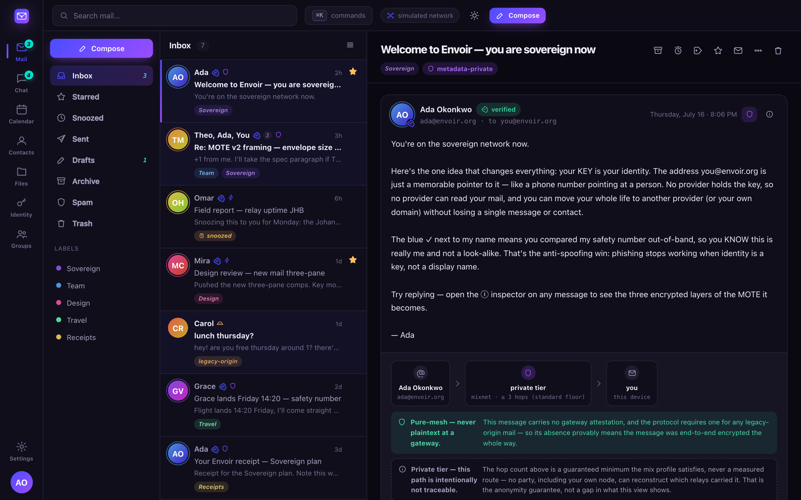
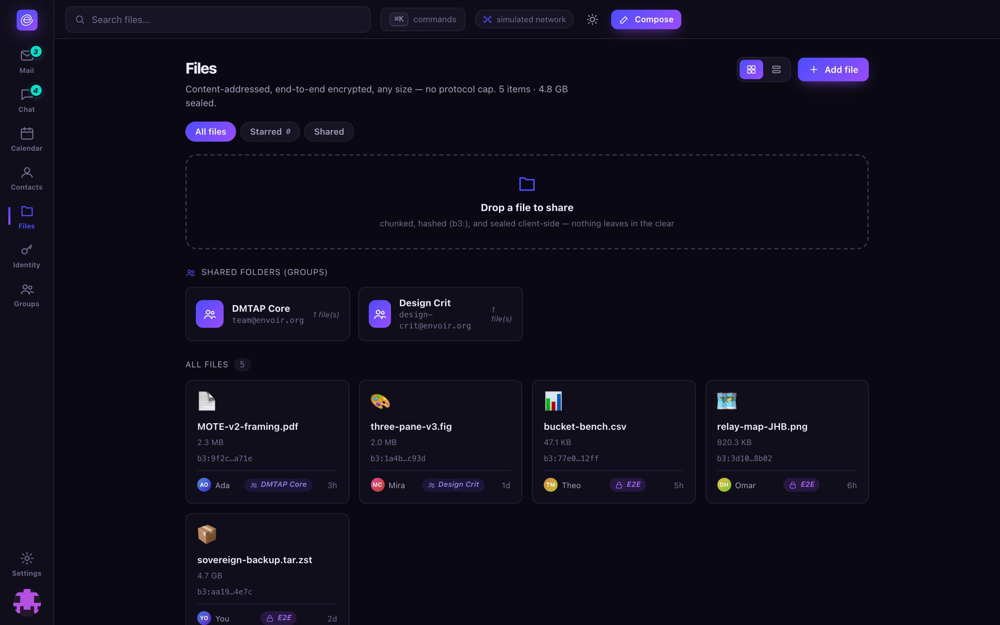
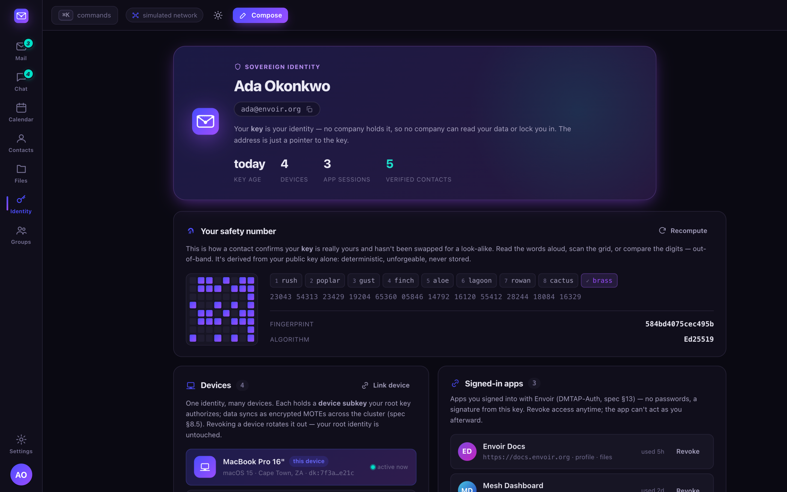
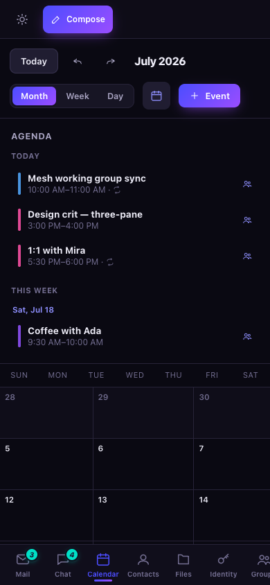
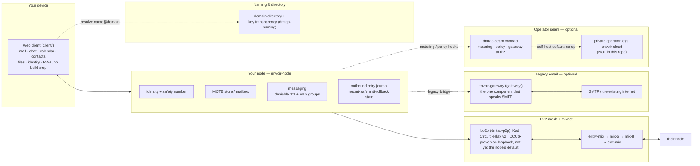

<p align="center">
  
</p>

<h1 align="center">Envoir</h1>

<p align="center">
  <b>Sovereign mail, chat, files &amp; identity — your key is your identity, not an account.</b>
</p>

<p align="center">
  <a href="LICENSE-MIT"></a>
  <a href="node/Cargo.toml"></a>
  
  <a href="https://github.com/vul-os/dmtap"></a>
</p>

<p align="center">
  
  
</p>

## What is Envoir

Envoir is the open-source reference implementation of **[DMTAP](https://github.com/vul-os/dmtap)**
(the Decentralized Message Transfer & Access Protocol): one sovereign **keypair identity** for mail,
chat, calendar, contacts, files, and groups, delivered over a peer-to-peer mesh and mixnet so that
not even a global observer sees who talks to whom. A human address like `you@envoir.org` is only a
*pointer* to your key — lose the provider, keep the identity. Naming itself is **pluggable**: a
zero-authority key-name and a local petname need no DNS at all, `name@domain` (DNS + key
transparency) is the default, and an OPTIONAL crypto name-chain resolver (ENS `.eth` / SNS `.sol`,
off by default, bound by four guardrails) is a third alternative — every rung still resolves to,
and pins, the same key. See [docs/naming.md](docs/naming.md). An optional gateway bridges DMTAP to
legacy SMTP so it's useful on day one, and fades as the network grows. Envoir is to DMTAP what
Element is to Matrix: the branded, MIT-licensed apps for an open protocol. There is **no
cryptocurrency and no blockchain** anywhere in this project — anti-abuse for cold contact uses
anonymous Privacy-Pass-style rate-limit tokens, proof-of-work, and optional real-money postage,
never a coin.

| Surface | What it gives you |
|---|---|
| **Mail** | Three-pane inbox, threading, labels, snooze, scheduled/undo send, per-message **transport-path provenance** |
| **Chat** | DMs (deniable X3DH + Double Ratchet) and channels (signed MLS groups) on the same MOTE substrate |
| **Calendar** | Month/week/day views + agenda, recurring events, meetings with invitees, peer-to-peer invitations + RSVP |
| **Contacts** | Per-contact key verification — TOFU-pinned vs. verified via safety number — not just a name and photo |
| **Files** | Content-addressed, end-to-end encrypted, any size; a shared folder *is* a group |
| **Groups** | A group has an address (`team@envoir.org`); broadcast vs. channel, members + roles |
| **Identity** | Safety number (words/digits/QR-grid), avatars/profile, linked devices, signed-in apps, recovery phrase |
| **Installable & offline** | A PWA: home-screen install, offline app-shell load, content-free Web Push wake-pings |

This repository is a **reference implementation / preview** — a real client compiles the Rust core
to WASM and speaks to a real mesh; today's web client simulates the network (clearly labeled) so the
whole protocol is demonstrable end to end in a browser, installable and fully responsive down to
phone width. See [Security & honesty](#security--honesty) for exactly what's real.

## Mail

Three-pane conversation view with folders, color labels, star/archive/snooze, scheduled send, undo
send, and rich compose with signatures. Every message carries a **verified ✓** badge once you've
checked its sender's safety number, and a clear **legacy-origin** marker when it arrived through the
gateway rather than pure-mesh.

<p align="center">
  
  
</p>

## Chat

DMs and channels (channels are **groups with addresses**) over the same MOTE substrate as mail, just
`kind=chat` on the fast tier. Every conversation header carries an honest protocol badge: a DM is
**Deniable 1:1** (pairwise X3DH + Double Ratchet, MAC-authenticated — no signature ties a message to
you), a channel is **MLS group · signed** (scales to any group size, but each message's signature is
non-repudiable). Click the badge for the tradeoff, spelled out in full.

<p align="center">
  
  
</p>

## Calendar

Month, week, and day views with an always-visible agenda rail, recurring events, and per-event
reminders. Adding invitees turns an event into a **meeting**; invitations and RSVPs travel as
peer-to-peer MOTEs — free/busy is a message, not a query against a central calendar server. See
[docs/features/calendar.md](docs/features/calendar.md).

<p align="center">
  
  
</p>

## Contacts

An address book where the **key**, not the name or photo, is what's being verified: every card
shows **verified** (safety-number checked), **TOFU-pinned**, or **legacy**, plus a gradient
avatar, opt-in Gravatar-style picture, or key-derived identicon. See
[docs/features/contacts.md](docs/features/contacts.md).

<p align="center">
  
</p>

## Transport-path provenance

Every received message carries a recipient-only provenance record: which transport **tier** it
arrived on, whether it is **pure-mesh** (never plaintext at any gateway) or **gateway-touched**
(legacy-origin, with a verified domain-anchored attestation), and — for the private tier — a
guaranteed **hop-count floor**, never a measured route. The UI is careful never to invent a mix-node
identity or claim more anonymity than the tier actually provides.

<p align="center">
  
</p>

## Files

Content-addressed, end-to-end encrypted, chunked and hashed client-side — any file size, no protocol
cap. A shared folder is simply a **group**: drop a file, and everyone with membership can read it.

<p align="center">
  
</p>

## Identity

Your key is the security boundary; the address is just a pointer to it. The Identity view surfaces
the **safety number** (words, digits, and a scannable grid, derived deterministically from your
public key alone), your **avatar and profile** (a public URL, an opt-in Gravatar-style picture, or
a deterministic key-identicon as the fallback — never something that changes your safety number),
your linked devices, your signed-in apps, and recovery. See
[docs/features/identity.md](docs/features/identity.md#avatars-and-profile).

<p align="center">
  
</p>

## Capabilities, and Envoir Send

Every fine-grained permission in DMTAP — reading one mailbox folder, posting to one channel,
sending mail programmatically — is a signed, offline-verifiable **delegated capability token**
(a UCAN profile, [`crates/dmtap-core/src/capability.rs`](crates/dmtap-core/src/capability.rs)):
attenuable (a child grant can only narrow its parent, never widen it) and independently
**revocable**, so rotating one scoped credential never touches the root identity key. The natural
application built on that primitive is **Envoir Send** — a Resend-style programmatic mail-sending
API where every API key is a narrowly-scoped, rotatable send-only capability: a sovereign,
self-hostable alternative to a hosted transactional-email service. The capability primitive itself
is real and tested today; the dedicated send-service surface is a roadmap item, not yet part of
this workspace. See [docs/protocol.md](docs/protocol.md#delegated-capabilities-and-envoir-send).

## Installable, offline, and mobile

The client is a real **Progressive Web App**: `manifest.webmanifest` + a service worker that
precaches the app shell so it opens even offline, an install affordance wired to the browser's own
install prompt, and **content-free Web Push** — a wake-up ping whose payload is deliberately never
read, so it can only ever mean "your node has something new, go sync," never who or what. The
whole UI is responsive down to ~360px phones, with a bottom tab bar below 680px. See
[docs/pwa-and-push.md](docs/pwa-and-push.md) for the full model, including its one disclosed
residual: on iOS, Apple's own **APNs** unavoidably sits in the delivery path for *any* web app's
push, Envoir included — the ping stays content-free through it, but its existence and timing are
visible to Apple as the platform operator, exactly as for any other web app.

<p align="center">
  
  
  
  
  
</p>
<p align="center"><sub>The same app, responsive down to ~360px — Mail · Chat · Identity · Calendar · Contacts</sub></p>

## Architecture



In **self-host** mode every `dmtap-seam` hook is unlimited/no-op, so the OSS stack is fully
functional standalone — the operator seam and any hosted operator are optional.

| Path | What it is |
|---|---|
| [`node/`](node) | **envoir-node** — the whole client side: identity, mailbox, mesh, messaging, files, and the IMAP/POP3/SMTP-submission/JMAP client servers |
| [`gateway/`](gateway) | **envoir-gateway** — the optional legacy SMTP bridge; the only component that isn't content-blind; lives here by design, kept loosely coupled for a future split into its own repo (see [`gateway/SEPARATION.md`](gateway/SEPARATION.md)) |
| [`crates/dmtap-core`](crates/dmtap-core) | Identity, MOTE, content addressing, canonical CBOR, delegated capability tokens, DMTAP-PUB public objects (§22) + the CAD/artifact profile (§23) — the shared primitives |
| [`crates/dmtap-auth`](crates/dmtap-auth) | DMTAP-Auth — decentralized, key-based sign-in |
| [`crates/dmtap-deniable`](crates/dmtap-deniable) | Deniable 1:1 messaging (X3DH + Double Ratchet) |
| [`crates/dmtap-mls`](crates/dmtap-mls) | MLS group messaging |
| [`crates/dmtap-mail`](crates/dmtap-mail) | Client protocol servers: IMAP/POP3/SMTP-submission, JMAP, autodiscovery |
| [`crates/dmtap-naming`](crates/dmtap-naming) | The pluggable naming/addressing resolver framework (key-name, petname, DNS + key-transparency, optional name-chains) — see [docs/naming.md](docs/naming.md) |
| [`crates/dmtap-p2p`](crates/dmtap-p2p) | The real libp2p mesh transport (TCP/QUIC+Noise+Yamux, Kademlia, Circuit Relay v2 + DCUtR), proven on loopback — not yet the node binary's default |
| [`crates/dmtap-seam`](crates/dmtap-seam) | The **operator seam**: the contract a hosted operator implements |
| [`crates/conformance-runner`](crates/conformance-runner) | Runs the implementation against the spec's conformance catalog |
| [`crates/netsim`](crates/netsim), [`crates/downgrade-tests`](crates/downgrade-tests) | Network simulation + downgrade-attack regressions |
| [`client/`](client) | Web client — mail, chat, calendar, contacts, files, groups, identity; installable PWA with offline shell + push |
| [`console/`](console) | Open-source **domain admin** console (org-level, never sees member keys) |
| [`status/`](status) | Public + personal status page |
| [`superadmin/`](superadmin) | Fleet operator console — content-blind by construction |
| [`site/`](site) | Marketing/landing page |
| [`integration/`](integration), [`fuzz/`](fuzz), [`formal/`](formal) | Cross-component + adversarial tests, wire-decoder fuzzing, ProVerif symbolic models |
| [`brand/`](brand) | Logo marks, wordmark, and the Aurora Indigo design tokens |

The private billing/management layer for a hosted operator (e.g. `envoir-cloud`) is a **separate,
non-OSS repository** that implements `dmtap-seam` out of process — it is never part of this
workspace, and it never gates a protocol, client, or privacy feature.

## Quickstart

```sh
# Build the whole workspace (node, gateway, and every crate)
cargo build --workspace

# Two in-process nodes exchange a real, end-to-end-encrypted MOTE
cargo run -p envoir-node -- demo

# The real node daemon (persists identity + outbound queue, serves until stopped)
cargo run -p envoir-node -- init   # once, to create a keystore
cargo run -p envoir-node -- run

# The optional legacy-email bridge — real IMAP/POP3/SMTP-submission live here, not on the node
# (see gateway/README.md for the 2-command personal quickstart)
cargo run -p envoir-gateway -- run
```

The web client needs no build step — no framework, no npm, no CDNs:

```sh
cd client
python3 -m http.server 8095
# open http://localhost:8095
```

`console/`, `status/`, `superadmin/`, and `site/` each run the same way — see their own `README.md`.

## Self-hosting

Self-hosting is not a crippled tier — every protocol feature, client, and privacy guarantee is
available with no operator at all; a hosted operator only ever sells convenience (see
[docs/features/self-hosting.md](docs/features/self-hosting.md)). Beyond the `cargo run` commands
above, a [`deploy/`](deploy) directory (reference Docker/compose and process-supervision examples
for `envoir-node`) is available — see its own [`README.md`](deploy/README.md) for the exact steps.

## Spec

The normative specification is **not** in this repository — it lives in the sibling
**[env-oir/dmtap](https://github.com/vul-os/dmtap)** repo: 22 markdown sections (identity, MOTE,
naming, transport, messaging, privacy, gateway, clients, anti-abuse, conformance, and more), a
registry of **132 error codes** (§21.3–§21.11), grounded against current standards, plus a
compiled **`dmtap.pdf`**. This repo is one implementation of that spec; conformance is checked
mechanically by [`crates/conformance-runner`](crates/conformance-runner) against the spec's own
**157-case conformance catalog** — see [Security & honesty](#security--honesty).

## Security & honesty

Envoir's privacy model is **honest, not absolute**: recovery is a first-class, versioned, signed
policy (spec §1.4) built from phrase, linked-device, and Shamir'd social-guardian factors that the
owner composes and rotates — never a silent key-escrow backdoor. (The web client's onboarding shows
a 12-word demo phrase; a real client uses the full SLIP-0039 word list.) Six ceremonies and
composed primitives — the deniable 1:1 handshake and its offline deniability, DMTAP-Auth sign-in,
the MLS group key schedule, key-transparency append-only logs, and mixnet unlinkability — have
machine-checked **ProVerif symbolic models** in [`formal/`](formal) (secrecy, mutual
authentication, forward secrecy, deniability, replay/origin-binding, post-compromise security,
inclusion/no-rollback/split-view soundness — see its README for exact property statements and
honest limitations); the wire-format
decoders are exercised by **`cargo-fuzz`** targets in [`fuzz/`](fuzz); a **157-case conformance
suite** runs 148 cases to a pass today (0 failures, the other 9 each skipped with a documented
reason) via [`crates/conformance-runner`](crates/conformance-runner); the node's anti-rollback/anti-abuse state
survives a restart instead of resetting to a weaker baseline; and `cargo test --workspace` runs
**771 passing tests**. [`integration/`](integration) adds dedicated adversarial tests on top. None
of this substitutes for an **independent external security audit**, which has not yet happened and
is the gate before any production deployment. Treat everything here as pre-alpha.

## License

[MIT](LICENSE-MIT) OR [Apache-2.0](LICENSE-APACHE) — © VulOS. Dual-licensed (Apache
adds an explicit patent grant); source and issues at
[github.com/vul-os/envoir](https://github.com/vul-os/envoir).

---

<p align="center">
  <a href="https://vulos.org"></a><br>
  <sub><a href="https://vulos.org"><b>vulos</b></a> — open by design</sub>
</p>
