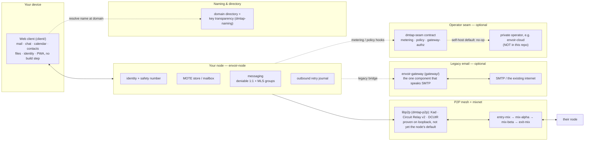
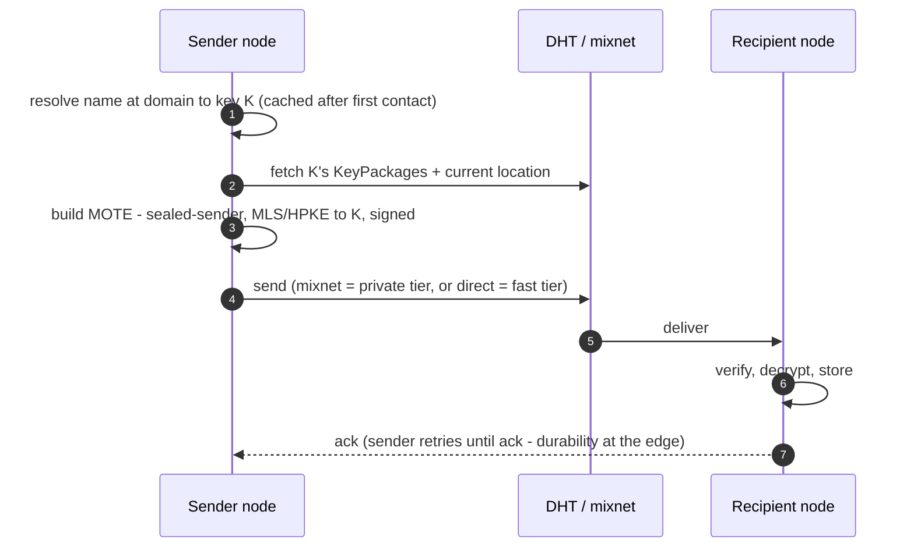

# Architecture

Envoir has exactly two pieces of software, plus DNS (which it doesn't run): the **node** and the
**gateway**. Everything else in this repository — the web client, the admin consoles, the status
page — is a client of one or the other.

## The whole picture

In **self-host** mode every `dmtap-seam` hook is unlimited/no-op, so the OSS stack is fully
functional standalone (see [features/self-hosting.md](features/self-hosting.md)) — the operator
seam and any hosted operator are optional convenience, never a required intermediary.

## The node — envoir-node

One binary, meant to run on any box that's on most of the time (a Pi, a NAS, a small VPS, a laptop
that's usually awake). It holds **all durable state** and does **all the real work**:

- Identity — root keypair, device subkeys, recovery policy ([features/identity.md](features/identity.md)).
- Store — the mailbox and file blobs (encrypted MOTEs + content-addressed chunks).
- Mesh participation — peer discovery over a DHT, relaying for others, delivery.
- Mixnet client — onion-wrapping, cover traffic, sealed sender.
- Messaging — MLS groups for 1:1, chat, and file folders; the optional deniable 1:1 mode.
- Client access — JMAP natively, plus IMAP/POP3/SMTP-submission and CalDAV/CardDAV compatibility servers.
- The outbound retry journal — durability lives here, not in the mesh.

A node MAY additionally run in **relay mode** (helping NAT'd peers reach each other, if it has a
public address) or **mix mode** (be a mixnet hop). These are capabilities of the same binary, not
separate programs — see [`node/README.md`](../node/README.md).

## The gateway — envoir-gateway (optional)

The **only** component that speaks SMTP, and the only one that is not content-blind (the legacy
leg is unavoidably plaintext). It:

- Receives inbound legacy mail (acts as MX for a domain), wraps it into a MOTE, attests it with a
  domain-anchored key, and delivers into the mesh — returning SMTP `451` if the recipient is
  offline so the sending server's own queue retries.
- Sends outbound legacy mail, DKIM-signing as the user's domain via a delegated selector — it
  never holds the user's DMTAP identity key.
- Carries the one operationally heavy cost the system cannot avoid: IP reputation.

The gateway is **stateless** — it holds no queue and no mailbox; durability is punted to whichever
edge (sender or receiver) is durable. A node with no legacy correspondents never invokes a
gateway, and at full DMTAP adoption the gateway becomes unnecessary. See
[protocol.md](protocol.md#the-legacy-gateway) and [features/self-hosting.md](features/self-hosting.md).

## The mesh and mixnet

The node **is** the mesh — relay and mix roles are capabilities of the node binary, not separate
services. It builds on **libp2p** (Kademlia DHT, circuit relay v2, DCUtR hole-punching, QUIC/TCP
transports secured by Noise/Yamux) so a node behind CGNAT or on a dynamic IP is reachable by its
key, not its address. [`crates/dmtap-p2p`](../crates/dmtap-p2p) implements this transport for
real — two live libp2p swarms exchanging a sealed MOTE and an ack over the wire, a working
Kademlia PUT/GET, and a Circuit-Relay-v2 reservation that delivers a frame to a peer with no
direct address at all, all proven on loopback by dedicated tests. It is not yet the transport
`envoir-node`'s `run`/`serve-mail` commands use by default — see [roadmap.md](roadmap.md) for
exactly what's wired into the binary today versus proven at the crate level.

The privacy layer on top is a **mixnet** profiled from Sphinx (packet format) and Loopix/Nym
(operational design): messages travel as fixed-length, onion-wrapped packets through a 3-hop
stratified path (entry → middle → exit), mixed with Poisson delays and cover traffic. See
[privacy.md](privacy.md) for the full threat model this buys you.

## Naming & key transparency

A human address (`you@envoir.org`) is a discovery pointer, never proof — the key is always the
identity and the sole root of trust. Resolution: DNS TXT/SVCB record → key-transparency check →
pin on first use (TOFU) → route by key over the mesh from then on. `name@domain` is the default,
but naming itself is **pluggable**: a zero-authority key-name and a local petname need no network
at all, and an OPTIONAL `name-chain` resolver (ENS `.eth` / SNS `.sol`, off by default) adds a
third, guarded alternative below the same fixed point — every rung still resolves to, and is
pinned as, a key. See [naming.md](naming.md) for the full ladder,
[features/identity.md](features/identity.md), and
[protocol.md](protocol.md#naming--key-transparency).

## Message flow

No gateway, no SMTP, no plaintext outside the two endpoints. The middle (mesh, mixnet, gateway)
holds **no durable user data** — durability is always punted to an edge.

## Where an operator's billing sits

Envoir/DMTAP is designed so a commercial control-plane (e.g. a private `envoir-cloud`) can add
billing and multi-tenant management **without forking the protocol**. The seam is four
capabilities — Metering, Provisioning, Policy, GatewayAuthz — defined by
[`crates/dmtap-seam`](../crates/dmtap-seam) and its [`CONTRACT.md`](../crates/dmtap-seam/CONTRACT.md).
Every hook has a self-host default that is unlimited/no-op, so the OSS runs unrestricted with no
operator at all.

The inviolable rule: **privacy, cryptography, metadata privacy, and recovery are never behind the
seam.** The seam only ever meters and limits *operations* (storage, legacy-gateway egress, relay
bandwidth) and *organizational* concerns (accounts, quotas, domains) — never a user's ability to
encrypt, verify, or read their own mailbox. See
[features/self-hosting.md](features/self-hosting.md#billing-is-tied-to-the-gateway-only) for the
billing-vs-native-mesh line in practice.

Any such control-plane is a **separate, non-OSS repository** — it is never part of this workspace.

## App map

| App | Answers | Docs |
|---|---|---|
| [`client/`](../client) | "I am one sovereign identity" | [features/identity.md](features/identity.md) |
| [`console/`](../console) | "I administer a domain full of them" | [`console/README.md`](../console/README.md) |
| [`superadmin/`](../superadmin) | "I operate the fleet that carries them all" | [`superadmin/README.md`](../superadmin/README.md) |
| [`status/`](../status) | "Is my mail working right now?" | [`status/README.md`](../status/README.md) |
| [`site/`](../site) | The public pitch | [`site/README.md`](../site/README.md) |
