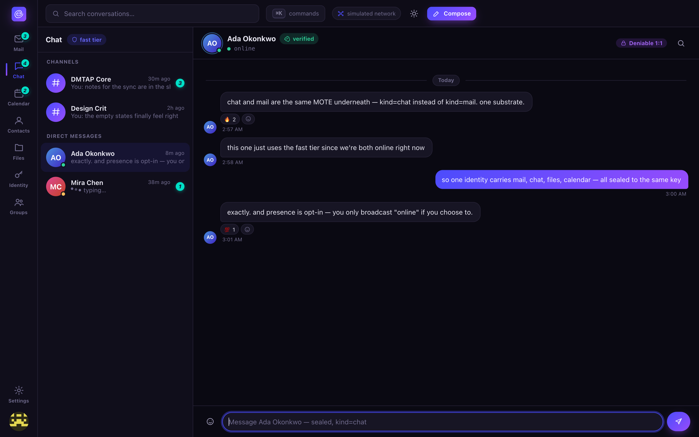

# Chat

DMs and channels over the same MOTE substrate as mail — just `kind = chat` on the faster tier.
Channels are simply **groups with addresses** (see [Groups](groups.md)).

## Starting a conversation

Open **Chat** from the left rail. Pick an existing conversation from the list, or start a new one
from a contact's card (see [Contacts](contacts.md)) or by addressing a message straight to someone
from the command palette (`⌘K`/`Ctrl K`). Type and send exactly as you would in any chat app —
messages appear in the thread immediately.

## The honest protocol badge

Every conversation header states plainly which cryptographic mode it's using, because the two
available modes make genuinely different tradeoffs and Envoir doesn't paper over the difference:

- **Deniable 1:1** — a pairwise X3DH/PQXDH handshake + Double Ratchet, authenticated by a
  shared-key MAC. No signature ever ties a message to you: either party could have produced any
  given transcript, so neither can prove authorship to a third party. See
  [Privacy & threat model](../privacy.md#deniability-is-optional-and-11-only) for exactly what
  this does and doesn't protect against.
- **MLS group · signed** — the default for channels and any group of three or more. Scales to any
  group size and gives strong forward secrecy and post-compromise security, but every message is
  signed and therefore **non-repudiable** — this is an inherent property of MLS (RFC 9420), not a
  missing feature.

Click the badge in the client to see the tradeoff spelled out in full. The deniable mode is always
an **explicit, per-conversation choice**, never a silent default, and the client never silently
falls back to deniable-off if your counterpart hasn't advertised support for it — you're told and
asked, not quietly downgraded.

## Why deniability needs its own mode

MLS's forward secrecy and post-compromise security come from a signed ratchet tree — signatures
that make every message attributable by design (RFC 9420 says outright that MLS makes no
deniability claims). Rather than weaken MLS's signatures to fake deniability (which would break
its own security proof), Envoir runs a **separate, proven** protocol beside the 2-member MLS group
when you opt in: the same Signal-style X3DH/PQXDH + Double Ratchet construction Signal itself
uses, reusing existing, audited cryptography instead of inventing something new. Both handshake
and repudiation are formally verified — see
[Security](../security.md#formal-proverif-models).

**What it doesn't protect against:** a device that logs its own plaintext as displayed still
proves content, regardless of any repudiation protocol — deniability is about the cryptographic
transcript, not about a compromised or coerced endpoint. One-way threads (send-only, no reply
ever) don't get post-compromise healing until a reply flows, because that healing needs a fresh
contribution from the other party's ratchet step.

## Presence and typing

Opt-in and off by default, because they're metadata-sensitive — Envoir doesn't turn on a signal
that reveals when you're active unless you've asked for it (Settings →
[Privacy & network](settings.md#privacy-network)).

## Channels and roles

A group has its **own keypair** and its own address on the naming ladder (`team@company.com`,
`@core`, or a bare key), and two posting models — broadcast/list (hidden membership, typical for
announce channels) and collaborative/channel (visible membership, a shared ordered conversation).
Roles (`owner`, `admin`, `member`) gate management operations, and every change is signed and
appears in the group's own audit trail. See [Groups](groups.md) for creating one, adding members,
and managing roles.

## What's real vs. simulated today

Message composition, the protocol badge, and the deniable/MLS distinction are real client
concepts backed by real formally-verified crates (`dmtap-deniable`, `dmtap-mls`). As with every
other module, message *delivery* across the mesh is the same clearly-labeled in-browser simulation
described in [`client/README.md`](../../client/README.md) — see [Roadmap](../roadmap.md) for the
project-wide real-vs-simulated line.
