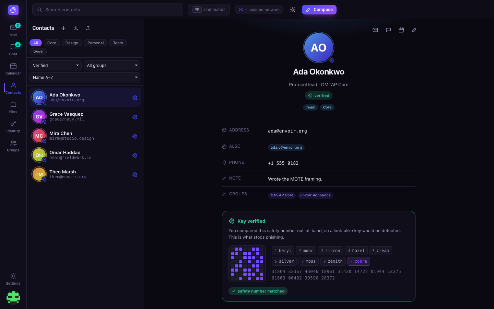
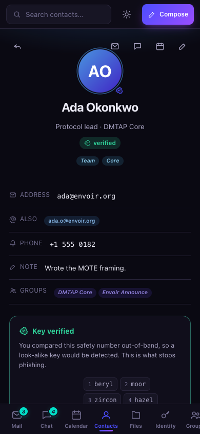

# Contacts

An address book where the **key**, not the name or photo, is the thing being verified — every
contact card shows a real trust status, not just a name and an avatar. Contacts are `kind =
contact` MOTEs (spec §8.4, JSContact-shaped), synced the same way as mail, chat, and calendar.

  

## What you get

- **Cards** with org/title/phone, tag-based organization, and membership in real addressable
  [groups](chat.md#groups-roles-and-posting-models) — searchable, filterable, and sortable (by
  name, recently added, or verification status).
- **Per-contact key verification status**, front and center on every card:
  - **Verified** — you've compared this contact's [safety number](identity.md#safety-numbers)
    out-of-band and confirmed the key.
  - **TOFU-pinned** — trust-on-first-use: you've exchanged messages, so a key is pinned, but you
    haven't independently verified it yet.
  - **Legacy** — the contact has no DMTAP key at all; you only have a legacy (SMTP) address for
    them, reached through the [gateway](self-hosting.md).
- **Gradient avatars, Gravatar (opt-in), or a key-derived identicon** — see
  [identity.md](identity.md#avatars-and-profile) for the full avatar ladder; the same standard
  applies to your own profile and to how a contact's picture is rendered.
- **Import/export** affordances and quick actions that jump straight into mail, chat, or a
  prefilled meeting invite in [Calendar](calendar.md) — contacts are the shared address book every
  other module reads from, not a silo.

  

## Why verification status is the headline, not an afterthought

A display name and a photo are exactly what a phishing attempt gets to choose freely — they prove
nothing. The **safety number** is the one thing that closes the gap trust-on-first-use leaves open:
a look-alike key substituted before either side has verified anything. Putting that status
directly on the contact card (rather than burying it in a details screen) is a deliberate choice —
see [identity.md](identity.md#safety-numbers) for exactly what "verified" means and how it's
computed.

## What's real vs. simulated today

Contact creation, tagging, filtering, import/export, and the verification-status computation
(a real deterministic safety-number derivation) are real code. As with every other module in this
reference client, the address book itself is seeded demo data (`seed.js`) and there is no real
directory sync yet — a production client resolves and pins contacts against the real
naming/key-transparency stack in [`crates/dmtap-naming`](../../crates/dmtap-naming). See
[roadmap.md](../roadmap.md) for the project-wide real-vs-simulated line.
