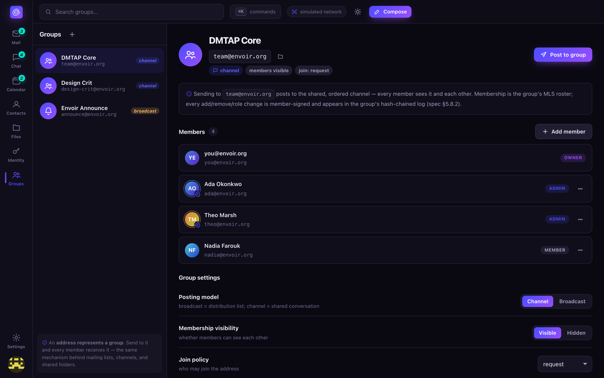

# Groups

A group is simply an **identity that has members** — its own keypair, its own address on the same
naming ladder as a person. Send to the address, and every current member receives it. This is the
same mechanism behind mailing lists, chat channels, and shared file folders — Envoir doesn't have
three separate systems for those, just one.

## Creating a group

Open **Groups** from the left rail and click **New group** (the `+` icon). Give it a name, pick an
address (`hikers@envoir.org`, for example — the group gets its own place on the naming ladder, so
it could just as easily be a key-name or an `@handle`), and choose a **posting model**:

- **Channel** — a shared, ordered conversation; membership is typically visible to members.
- **Broadcast** — a distribution list; every member gets a copy, membership is typically hidden
  from other members.

You become the **owner**. Set a **join policy** (closed / request / open / vouch) to control who
else can join later.

## Adding and managing members

Open a group and click **Add member** to pick from your contacts — this uses the invitee's MLS
KeyPackage and a Welcome message under the hood, so the addition is signed and appears in the
group's own audit log. Every member row shows their role; owners and admins can promote/demote a
member or remove them entirely from the row's overflow menu. Removing someone from a group
triggers a re-key of everything that member had access to (files included — see
[Files & sharing](files.md#removing-someones-access)) so they don't retain silent access going
forward.

## Posting to a group

Click **Post to group** from a group's header, which opens [Compose](compose.md) pre-addressed to
the group's own address — from there it's exactly like composing any other message. In a broadcast
group, each member gets their own sealed copy and doesn't see who else got one; in a channel,
everyone sees the same shared, ordered conversation.

## Roles and audit trail

Roles (`owner`, `admin`, `member`) gate management operations — add/remove members, change posting
model or join policy. Every such change is signed and appears in the group's own hash-chained log,
so "who added/removed whom, and when" is always answerable. A group's own signing key is
threshold-held by its admin set, so no single admin (and no ordering node) can unilaterally hijack
the group's address.

## Groups are also how sharing and channels work

- A [shared file folder](files.md) **is** a group — sharing a file into a group's folder uses this
  exact membership model, roles, and re-keying.
- [Chat](chat.md) channels **are** groups with a posting model of `channel`.
- Calendar meeting invitees can be drawn from a group in one step, rather than added one at a
  time — see [Calendar](calendar.md#inviting-people).

## What's real vs. simulated today

Group creation, membership management, role changes, and the posting-model/join-policy settings
are real client concepts, backed by the real, formally-modeled MLS group primitive
(`crates/dmtap-mls`). As with every other module, actually delivering a post to every member across
the mesh is a clearly-labeled in-browser simulation in this reference client — see
[Roadmap](../roadmap.md) for the project-wide real-vs-simulated line.
