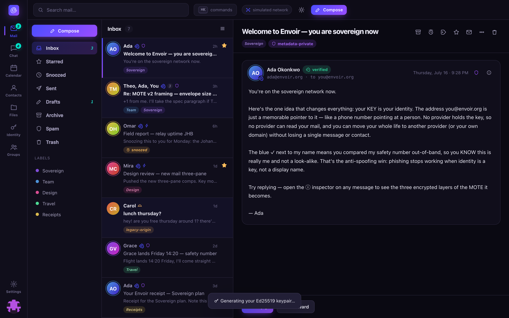

# Mail

Three-pane conversation view over the same MOTE substrate as everything else in Envoir — mail is
simply MOTEs of `kind = mail`, defaulting to the metadata-private `private` transport tier (see
[privacy.md](../privacy.md)).



## What you get

- Folders, color labels, star/archive/**snooze**, **scheduled send**, **undo send**, drafts, and
  rich compose with signatures.
- Conversation **threading** and multi-select bulk actions.
- A **verified ✓** badge once you've checked a sender's
  [safety number](identity.md#safety-numbers).
- A clear **legacy-origin** marker on any message that arrived through the
  [gateway](self-hosting.md) rather than pure-mesh — see
  [transport-traceability.md](transport-traceability.md) for exactly what that marker does and
  doesn't reveal.
- Calendar and contacts ride the same node as additional MOTE kinds — see below.

## How delivery works

Mail addressed to a DMTAP identity resolves `name@domain` to a key (see [identity.md](identity.md)),
is sealed as a MOTE, and travels the mixnet by default — see
[architecture.md](../architecture.md#message-flow) for the full sequence. Mail addressed to a
legacy address (`@gmail.com` and the like) is handed to a [gateway](self-hosting.md), which is the
only component in the whole system that speaks SMTP and the only one that isn't content-blind.

## Client protocols

The node exposes one MOTE store through several protocol front-ends (spec §8), so existing tools
work unchanged:

- **JMAP** (RFC 8620/8621) — the modern, native sync surface; new DMTAP-native clients should
  prefer it.
- **IMAP** (RFC 9051/3501) — a genuinely complete implementation in
  [`crates/dmtap-mail`](../../crates/dmtap-mail): CONDSTORE/QRESYNC, SEARCHRES, SORT/THREAD,
  BINARY sections, SPECIAL-USE, LIST-EXTENDED/LIST-STATUS, and an `O(log n)` UID-indexed store so
  a targeted fetch stays fast even against a large mailbox.
- **POP3** and **SMTP-submission** (RFC 1939 / RFC 6409, incl. DSN reports).
- **CalDAV/CardDAV** compatibility for calendar and contacts (see below).
- **Autodiscovery** — SRV records, Thunderbird autoconfig, Apple `.mobileconfig`, and Microsoft
  Autodiscover (both classic POX and v2 JSON).

All of these authenticate with **app-passwords** bound to the identity, never the identity keypair
itself, and are reached through the mesh (SNI/stream routing) so the node needs no static IP or
exposed port. Real TLS termination and a couple of niche extensions (cross-server CATENATE
URLFETCH, exotic nested-message BODYSTRUCTURE envelopes, JMAP push transport) are explicitly
deferred as transport concerns — see the crate's own capability matrix in
[`crates/dmtap-mail/README.md`](../../crates/dmtap-mail/README.md) for the exact list.

## Calendar & contacts

Not separate central services — additional MOTE kinds stored on the same node, end-to-end
encrypted, synced across your device cluster, and shared/invited via the same MLS groups as
everything else: events as JSCalendar (RFC 8984) and contacts as JSContact (RFC 9553), both synced
via JMAP alongside mail, with CalDAV (RFC 4791) / CardDAV (RFC 6352) compatibility servers for
Apple Calendar/Contacts, Thunderbird, and DAVx⁵. Invitations and RSVPs ride as MOTEs between
participants — free/busy and scheduling are messages, not a server query. See
[features/calendar.md](calendar.md) and [features/contacts.md](contacts.md) for the full feature
set of each, now at parity with Mail and Chat in the web client.

## Try it

```sh
cargo run -p envoir-node -- serve-mail
```

Runs real IMAP (`:1143`), POP3 (`:1110`), and SMTP-submission (`:1587`) servers against an
in-memory demo mailbox — see [getting-started.md](../getting-started.md).
