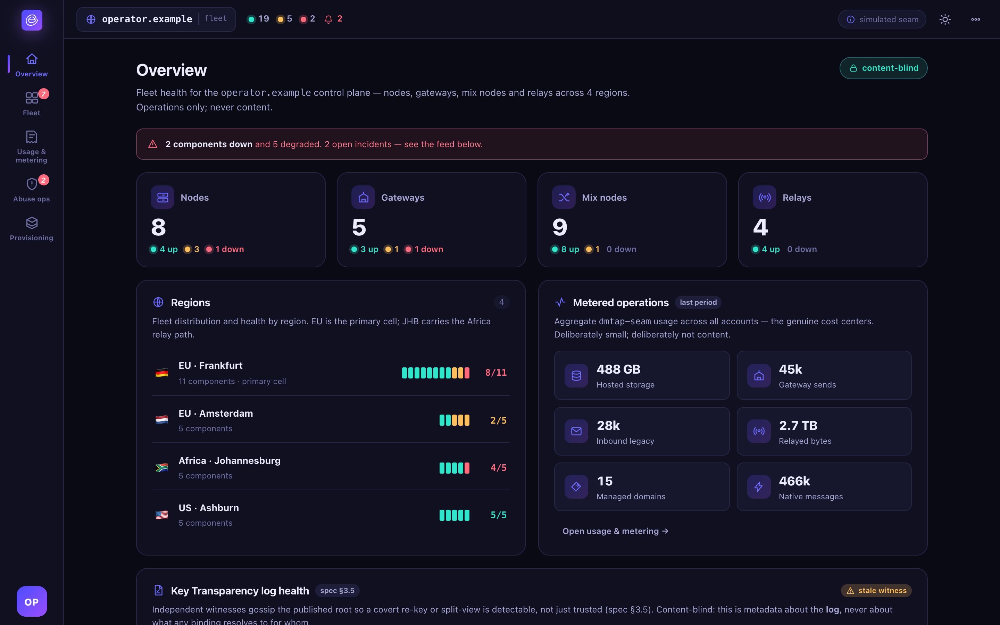

# Running the gateway

The legacy SMTP bridge, for operators who want to exchange mail with `@gmail.com` and the rest of
the old email world. Most self-hosters never need this page at all — see
[Self-hosting a node](self-hosting.md) for when you do.

## Does your node need a gateway?

**No, if** you and your correspondents are all DMTAP-native — native mesh delivery is key-based,
free, and needs no gateway at all. **Yes, if** you want to send or receive mail with people still
on legacy email. There's no shame in "not yet": a node with no legacy correspondents simply never
invokes `ENVOIR_GATEWAY_BIN`, and the option is there whenever you need it.

## Building and running it

The gateway is **not part of this workspace** — it ships from the separate
**[Ephor broker repo](https://github.com/vul-os/ephor)** as `cargo build -p gateway` there,
binary name `ephor-gateway`, run as a genuinely separate OS process, never linked into the node's
own address space:

```sh
# in the Ephor repo
cargo build -p gateway
GATEWAY_IMAP_ENABLE=1 GATEWAY_POP3_ENABLE=1 GATEWAY_SUBMISSION_ENABLE=1 \
  cargo run -p gateway -- run
```

This runs real IMAP (`:1143`), POP3 (`:1110`), and SMTP-submission (`:1587`) servers by default,
plus the inbound MX listener that actually receives legacy mail for your domain.

Point `envoir-node`'s dispatch shim at the resulting binary:

```sh
ENVOIR_GATEWAY_BIN=/path/to/ephor-gateway cargo run -p envoir-node -- gateway run
```

`envoir-node` keeps only a thin dispatch shim (`envoir-node gateway <args>` / `--gateway <args>`)
that `exec`s the externally-built binary — see
[`node/tests/gateway_dispatch.rs`](../../node/tests/gateway_dispatch.rs) for exactly what that
handoff does and does not guarantee (it fails closed with a clear error when no such binary is
reachable), and the Ephor repo's own README for the gateway's full configuration — inbound MX
listener, DKIM/attestation selector, STARTTLS, DNS-based MX/MTA-STS resolution — none of which
lives in this repository anymore.

## What the gateway actually does

- **Receives inbound legacy mail** (acts as MX for a domain), wraps it into a MOTE, attests it
  with a domain-anchored key, and delivers into the mesh — returning SMTP `451` if the recipient
  is offline so the sending server's own queue retries.
- **Sends outbound legacy mail**, DKIM-signing as the user's domain via a delegated selector — it
  never holds the user's DMTAP identity key.
- Carries the one operationally heavy cost the system cannot avoid: **IP reputation**.

It is **stateless** — no queue, no mailbox; durability is punted to whichever edge (sender or
receiver) is durable.

## Addressing without registration

Any identity key encodes to a stable `dmtap1-<base32-of-the-full-public-key>` local-part
([`node/src/naming.rs`](../../node/src/naming.rs)) — deterministic, reversible by any gateway with
no shared state, and identical whichever gateway a legacy sender happens to hit. This is what lets
a legacy correspondent reach you before you've registered anywhere. Once you *do* register with an
operator's gateway, it additionally allocates a short, content-address-derived default local-part
with an optional vanity name layered on top — a vanity request that would shadow another key's
reserved form is refused fail-closed, so a vanity name can never impersonate someone else.

## Anti-spam, in both directions

Inbound (legacy → DMTAP) and outbound (DMTAP → legacy) are gated **independently**, because they
carry opposite risks:

- **Inbound** runs a pre-`DATA` gate — RBL/DNSBL, SPF, DMARC-`p=` awareness, greylisting, per-IP
  rate limits — before the message body is ever accepted onto the wire.
- **Outbound** is authenticated-senders-only (no open relay), with a per-sender rate limit, a
  volume cap, and reputation/backoff that grows on bad delivery signals (bounces, 5xx, spam
  complaints) and decays as a sender sends cleanly again — because one self-hoster sending
  unlimited outbound mail would get the *shared* gateway IP blacklisted for everyone else behind
  it.

An operator can run the gateway wide open (a spam magnet, documented as such, never the default)
or in **key-registered** mode, where a sender is admitted only after proving control of a DMTAP
key by challenge–response.

## Fail-closed SSRF guard

As last measured before the gateway moved to the Ephor repo: outbound MX/MTA-STS resolution
refuses to connect to a destination that resolves only to a loopback, private, link-local, or
cloud-metadata address (including an IPv4-mapped IPv6 address judged by its embedded v4 form) —
otherwise a legacy sender could aim the gateway at the operator's own internal network. An
explicitly configured pinned address is the one deliberate, documented exemption. See
[Security](../security.md#downgrade--fail-closed-invariants).

## Billing, if you're running one for others

If you operate a gateway other people use, [transport-path provenance](transport-traceability.md)
is what makes usage auditable — see
[Self-hosting a node](self-hosting.md#billing-is-tied-to-the-gateway-only) for the full model
(native mesh delivery is always $0; only legacy-egress through *someone else's* gateway is ever
billable, and it's independently verifiable). The operator seam
([`crates/dmtap-seam`](../../crates/dmtap-seam)) is what a hosted operator implements for metering
and quotas — Envoir itself computes no price and renders no invoice.

For a fleet running multiple gateways/nodes for many tenants, the separate **superadmin console**
(content-blind by construction) gives an operator fleet-wide visibility without ever seeing user
content:



See [`superadmin/README.md`](../../superadmin/README.md) for that console's own model.
