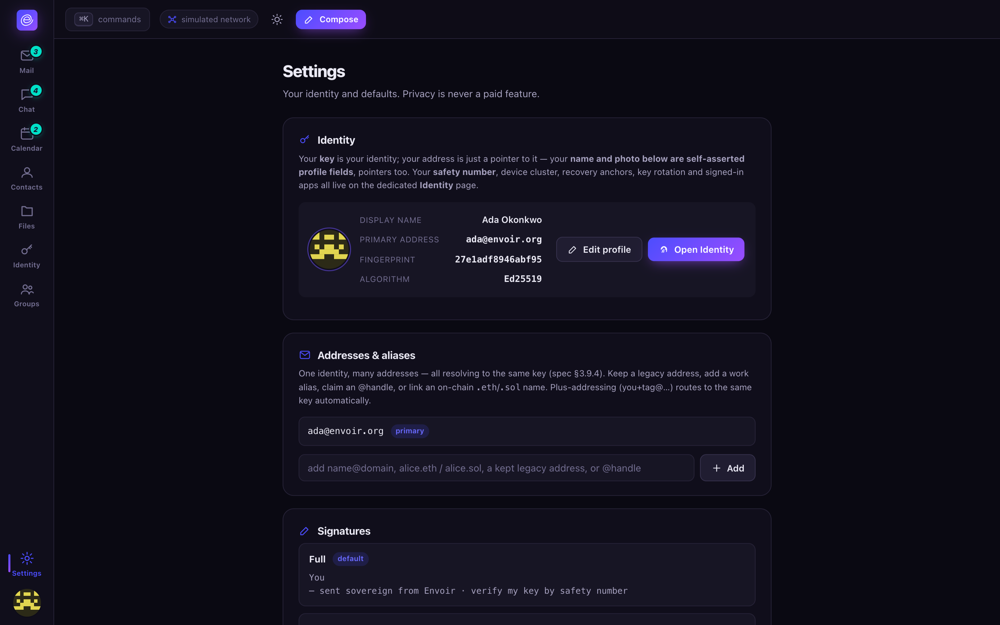

# Settings & devices

Everything that configures your account and your client lives in one scrollable Settings page —
identity essentials, addresses, mail behavior, privacy defaults, your real node connection, and
the app shell itself. Device management specifically lives one page over, on
[Identity](identity.md#devices), because it's part of the key hierarchy rather than a preference —
this page links to it where relevant.

## Identity

A short summary card with a link out to the full [Identity](identity.md) page — safety number,
device cluster, recovery anchors, key rotation, and signed-in apps all live there, not duplicated
here. Your display name and photo are edited from this card; changing them never touches your
safety number (see [Identity](identity.md#avatars-and-profile)).

## Addresses & aliases

One identity, many addresses, all resolving to the same key. From here you can keep a legacy
address as an alias, add a work alias, claim an `@handle`, or link an on-chain `.eth`/`.sol`
name-chain address — linking one requires the **bidirectional binding** described in
[Naming](../naming.md#name-chain-eth--sol--optional-crypto-name-chains-four-guardrails): your key
must claim the name, *and* the chain record must point back to your key, or the client refuses the
link. Plus-addressing (`you+tag@domain`) works automatically with no setup.

## Signatures, vacation responder, filters

- **Signatures** — a block of text/HTML appended to outgoing mail.
- **Vacation / auto-responder** — toggle it on, set a subject and message, and Envoir replies
  automatically to incoming mail while it's active.
- **Filters & rules** — create rules that label, star, archive, or spam-file matching incoming
  mail. These run on your own always-on node, not a third party's server, so they still apply
  while this client is closed and no one outside your mailbox ever sees the plaintext being
  matched. **Run rules on mailbox now** applies your current rules retroactively.

## Spam — block & allow lists

Recipient-local policy: blocked senders are filed straight to Spam, allowed senders always reach
your inbox. On a real node this is enforced *before decryption* for cold senders — the anti-abuse
mechanisms described in [Protocol](../protocol.md#anti-abuse-honestly) replace central content
scanning as the reason spam doesn't reach you.

## Privacy & network

- **Default privacy tier** — private (mixnet, metadata-private) or fast (direct, lower latency) —
  the default [Compose & send](compose.md#filling-in-the-message) starts new messages with; you
  can still override it per-message.
- **Presence & typing** — off by default because it's metadata-sensitive; see [Chat](chat.md#presence-and-typing).
- **Legacy gateway** — toggle whether this client bridges to the SMTP world at all. See
  [Self-hosting a node](self-hosting.md) for what running your own gateway looks like.

## Node connection — leaving the demo behind

This is the single most important toggle in Settings: pointing the client at a **real node**
instead of the built-in demo data.

1. Run your own node (see [Getting started](../getting-started.md#run-the-node)) or point at one
   an operator gave you.
2. Fill in the **node base URL**, your **username**, and an **app-password** — a node-issued
   secret scoped to this client, never your identity keypair itself (spec §8.2).
3. Optionally add a **send token** — a separate, scoped, revocable capability (spec §13.5.1) that
   authorizes real outbound send over the node's Envoir Send API. Without it, connecting still
   syncs and reads your real mailbox, but [Compose](compose.md#what-the-honest-send-note-means)
   stays honest: it will not fake a send.
4. Leave the fields blank to keep running as the labeled simulation.

The current mode — **live node** or **simulated** — is always visible, both here (as plain text)
and as the small pill in the top bar next to the theme toggle.

## Appearance

Switch between dark (the primary theme) and light. The theme toggle in the top bar does the same
thing without a trip to Settings.

## App — installing Envoir

Envoir works as an installable Progressive Web App: its own window, an offline-ready app shell,
and — with notifications on — the ability to wake in the background to sync. Click **Install app**
(shown whenever your browser offers the install prompt) to add it to your home screen or apps
list. See [PWA & push](../pwa-and-push.md) for the full model.

## Notifications

A push only ever means "your node has something new — open to sync" — the payload is
**content-free and sender-blind** by design, and your own node originates it, never a company
reading your mail to decide when to notify you. **Send test wake-ping** runs the exact
push → notification → wake-sync code path a real push event would, with no backend involved, so
you can see the mechanism work rather than a simulation of a different mechanism. See
[PWA & push](../pwa-and-push.md#web-push--a-content-free-wake-ping-by-design) for the full
model and its one disclosed residual on iOS.

## Keyboard shortcuts

Opens the same shortcuts overlay as pressing `?` anywhere in the app.

## Sign in with Envoir — demo

A working demonstration of [DMTAP-Auth](identity.md#signing-in-with-your-key--dmtap-auth): sign in
to a mock relying party using your key instead of a password, and see the origin-binding step play
out.

## Recovery phrase

A quick-access **Show** button for your recovery phrase — see
[Identity](identity.md#recovery) for what it protects and its one honest limit.

## What's real vs. simulated today

Every toggle and form on this page updates real client state. Whether your mailbox is *actually*
your own mail or the built-in demo data depends entirely on the Node connection section above —
see [Roadmap](../roadmap.md) for the project-wide real-vs-simulated line.
